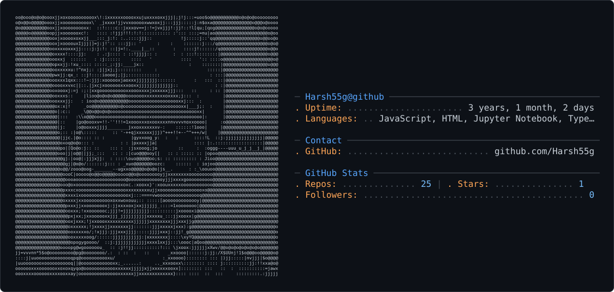

# Custom neofetch-style profile card — setup

This is a self-contained, hand-built version of the Andrew6rant-style card:
your avatar → ASCII art, plus live GitHub stats, plus whatever personal
fields you fill in yourself (OS, IDE, hobbies, contacts, etc.).

## What's in this folder

```
generate_card.py       <- run this, produces dark_mode.svg + light_mode.svg
lib/
  ascii_art.py          <- avatar -> ASCII grid
  gh_stats.py            <- live GitHub API stats (repos, stars, followers, commits, languages)
  render.py              <- draws the neofetch-style SVG
config.example.yml     <- copy to config.yml and edit with YOUR details
requirements.txt
refresh-card.yml        <- copy to .github/workflows/refresh-card.yml in your repo
```

## One-time setup

1. Copy everything in this folder into the root of your `Harsh55g/Harsh55g`
   repo (create that repo first as public, with a README, if it doesn't
   exist yet).
2. Rename `config.example.yml` -> `config.yml` and **edit every field marked
   `<-- edit`**: your OS, host/institute, "kernel" line, IDE, hobbies, and
   contact info (email/LinkedIn/Discord — delete any line you don't want
   shown).
3. Move `refresh-card.yml` into `.github/workflows/refresh-card.yml`
   (create those folders if needed).
4. Locally, test it once:
   ```
   pip install -r requirements.txt
   python3 generate_card.py
   ```
   This downloads your live GitHub avatar, pulls your real stats, and
   writes `dark_mode.svg` + `light_mode.svg`. Open both and check they look
   right (colors, no cut-off text — if a value is too long, shorten it in
   config.yml).
5. Add this to the top of your `README.md` (keep everything else below it):
   ```html
   <picture>
     <source media="(prefers-color-scheme: dark)" srcset="dark_mode.svg" />
     <source media="(prefers-color-scheme: light)" srcset="light_mode.svg" />
     
   </picture>
   ```
6. Commit everything (`config.yml`, the two SVGs, `generate_card.py`, `lib/`,
   `requirements.txt`, `.github/workflows/refresh-card.yml`, updated
   `README.md`) and push.
7. Go to the **Actions** tab on GitHub once, open "Refresh profile card",
   and click **Run workflow** to confirm it works end-to-end (it commits the
   freshly generated SVGs back to the repo). After that it runs daily on its
   own.

## Notes

- No `GITHUB_TOKEN` secret needs to be created manually — GitHub Actions
  injects one automatically per run for the stats/API calls.
- If you ever see the "Commits" row disappear, that's the commit-count
  search API degrading under rate limits — it's cosmetic and comes back.
- After ~60 days of no commits to the repo, GitHub auto-disables scheduled
  workflows and emails you — just hit "Run workflow" again to re-enable.
- Want to change what's on the card? Edit `config.yml` for personal fields,
  or `lib/render.py` -> `build_info_lines()` to add/remove whole rows
  (e.g. a WakaTime coding-time row, a "Currently learning" row, etc.).
